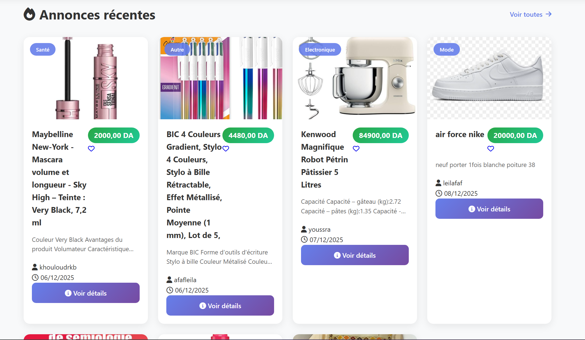

# 🛒 Market — Plateforme de petites annonces

Application web de type **marketplace** permettant aux utilisateurs d'acheter, vendre et échanger des articles via des petites annonces. Le projet comprend une **application web** (Spring Boot + Thymeleaf) et une **application mobile Android** (Capacitor) connectée à une API REST.


---

## ✨ Fonctionnalités

**Utilisateurs**
- 🔐 Inscription et connexion sécurisées (Spring Security, mots de passe chiffrés)
- 👤 Profil utilisateur modifiable

**Annonces**
- 📝 Publication d'annonces avec photos, prix et description
- 🗂️ Classement par catégories (Maison, Mode, Santé, Électronique, Autre)
- 🔍 Recherche d'annonces
- 📋 Gestion de ses propres annonces (« Mes annonces »)

**Interaction**
- ❤️ Favoris
- 🛍️ Panier
- 💬 Messagerie entre acheteurs et vendeurs
- ⭐ Système de notation

**Administration**
- 📊 Tableau de bord administrateur

**Mobile**
- 📱 Application Android (Capacitor) utilisant une API REST dédiée

---

## 🛠️ Technologies

| Couche | Technologies |
|---|---|
| Backend | Java 21, Spring Boot 4, Spring Security, Spring Data JPA (Hibernate) |
| Frontend web | Thymeleaf, HTML, CSS |
| Base de données | MySQL |
| Mobile | Capacitor (Android), JavaScript |
| Outils | Maven, Lombok, Git |

---

## 📸 Captures d'écran

| Accueil | Annonces récentes |
|---|---|
|  |  |

---

## 🚀 Lancer le projet en local

### Prérequis
- Java 21
- MySQL 8
- (Optionnel, pour le mobile) Node.js et Android Studio

### 1. Cloner le projet
```bash
git clone https://github.com/khokharkb/market-spring-boot.git
cd market-spring-boot
```

### 2. Configurer la base de données
La base `market` est créée automatiquement au démarrage.
Si votre MySQL n'utilise pas le port `3307`, modifiez l'URL dans `src/main/resources/application.properties` :
```properties
spring.datasource.url=jdbc:mysql://localhost:3306/market?createDatabaseIfNotExist=true
```

### 3. Définir les variables d'environnement
Les mots de passe ne sont pas stockés dans le code :

| Variable | Description |
|---|---|
| `DB_PASSWORD` | Mot de passe MySQL (utilisateur `root`) |
| `ADMIN_PASSWORD` | Mot de passe du compte administrateur créé au démarrage |

Sous IntelliJ : *Run → Edit Configurations → Environment variables*.

### 4. Démarrer l'application
```bash
./mvnw spring-boot:run
```
Puis ouvrir **http://localhost:8080**

### 5. (Optionnel) Application mobile
```bash
npm install
npx cap sync android
npx cap open android
```

---

## 📁 Structure du projet

```
src/main/java/org/example/market/
├── admin/        # Tableau de bord administrateur
├── annonce/      # Gestion des annonces et des images
├── api/mobile/   # API REST pour l'application mobile
├── favoris/      # Favoris
├── message/      # Messagerie
├── panier/       # Panier
├── rating/       # Notation
├── security/     # Authentification et sécurité
└── user/         # Utilisateurs et profils
```

---

## 👩‍💻 Auteur

**Khouloud** — [GitHub](https://github.com/khokharkb)
